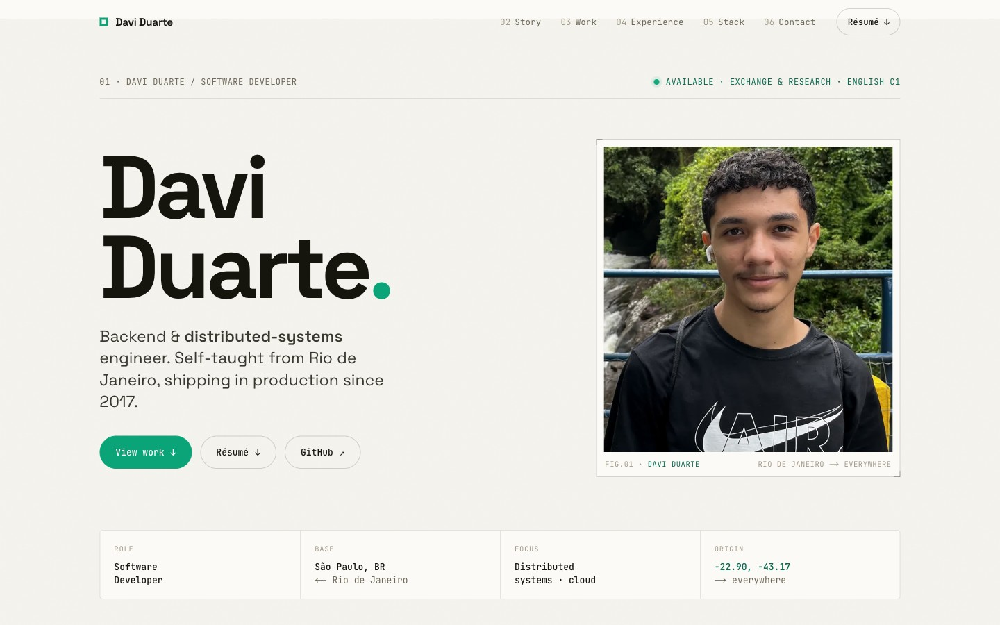
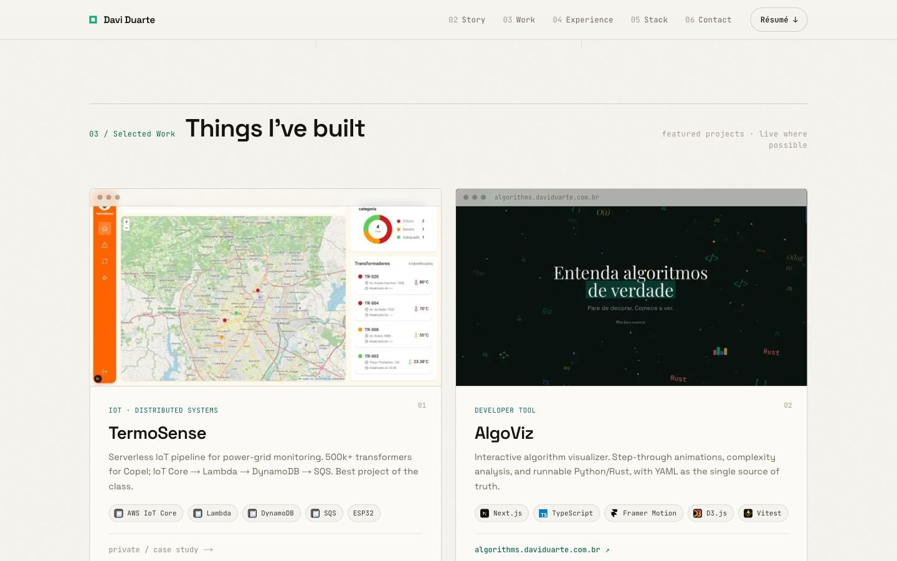
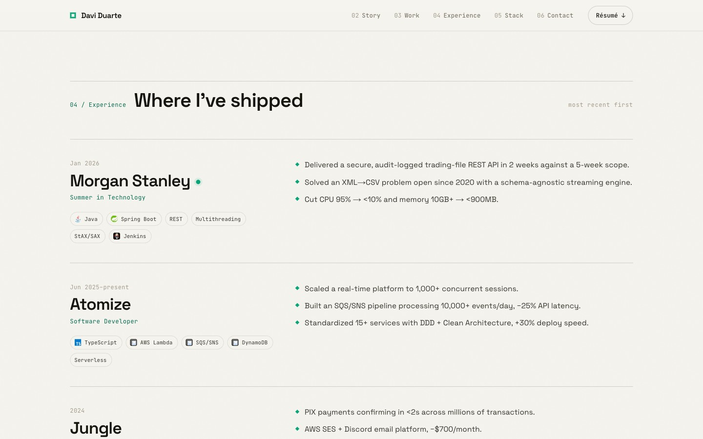

<div align="center">

# Davi Duarte — Portfolio

Backend & distributed-systems engineer. Self-taught from Rio de Janeiro, shipping in production since 2017.

**[→ daviduarte.com.br](https://daviduarte.com.br)**

[](https://daviduarte.com.br)
[](https://nextjs.org)
[](https://www.typescriptlang.org)

</div>



<table>
<tr>
<td width="50%"></td>
<td width="50%"></td>
</tr>
</table>

## About

A single-page portfolio, designed and built from scratch. Editorial layout, scroll-reveal
motion, and a single typed source of truth ([`src/content/profile.ts`](src/content/profile.ts))
that feeds every section — story, work, experience, stack, and contact.

## Featured projects

| Project | What it is | Live | Repo |
| --- | --- | :---: | :---: |
| **TermoSense** | Serverless IoT pipeline monitoring 500k+ power-grid transformers for Copel (IoT Core → Lambda → DynamoDB → SQS) | — | private |
| **AlgoViz** | Interactive algorithm visualizer — step-through animations, complexity analysis, runnable Python/Rust | [live](https://algorithms.daviduarte.com.br) | [yuhtin/algoviz](https://github.com/yuhtin/algoviz) |
| **AdaLove 2.0** | Full reimagining of Inteli's official study platform — JWT auth, weekly kanban, timeline & table views | — | [Yuhtin/adalove-cards-reimaginated](https://github.com/Yuhtin/adalove-cards-reimaginated) |
| **Aceito Fiado** | Credit infra for Black micro-entrepreneurs — alternative-data scoring, fiado checkout, payment split · 🏆 1st place + R$20k @ Feira Preta | [live](https://aceitofiado.daviduarte.com.br) | [yuhtin/aceito.fiado](https://github.com/yuhtin/aceito.fiado) |
| **ICS Select** | Platform behind ICS, the Big-Tech prep program run at Inteli — cohort plans synced to Google Calendar | [live](https://ics.daviduarte.com.br) | private |
| **DesenrolAI** | WhatsApp AI assistant for financial education (N8N + OpenAI + Evolution API) · 🏆 R$3k @ Inovahack | — | private |
| **SATA** | Instructor scheduling via integer linear programming (PuLP + heuristics) | — | [yuhtin/inteli-sata](https://github.com/yuhtin/inteli-sata) |
| **NextPlugins** | Open-source Java ecosystem — 70+ repos across 1,200 servers, 15k+ players | — | [NextPlugins](https://github.com/NextPlugins) |

## Tech stack

**Next.js** (App Router) · **TypeScript** · **Tailwind CSS** · custom scroll-reveal motion · deployed on **Vercel**.

## Run locally

```bash
pnpm install
pnpm dev
# http://localhost:3000
```

## Links

[Website](https://daviduarte.com.br) · [GitHub](https://github.com/yuhtin) · [LinkedIn](https://linkedin.com/in/daviduarte) · [Résumé](https://daviduarte.com.br/davi-duarte-resume.pdf)
